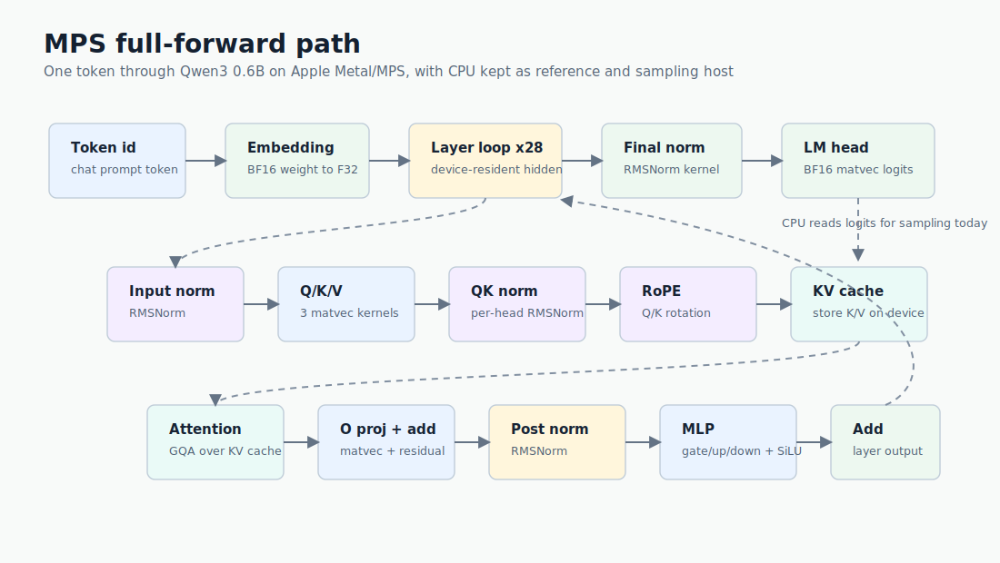
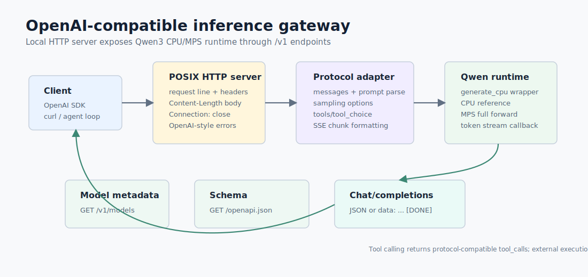

# kraken-infer

<p align="center">
  
</p>

`kraken-infer` 是一个 C++20 本地 LLM inference runtime，当前目标模型是
`Qwen/Qwen3-0.6B`。项目已经具备从模型目录检查、权重解析、CPU reference
forward、Apple Silicon Metal/MPS forward、KV cache decode、采样、streaming CLI，
到 OpenAI-compatible HTTP gateway 和浏览器对话页的一条完整本地推理链路。

核心定位：

- 不依赖现成 LLM runtime，关键推理链路自己实现。
- CPU path 作为 correctness reference。
- MPS path 逐算子对齐 CPU，再做后续性能优化。
- 公共 C++ 头文件保持平台无关，Apple API 隔离在 Objective-C++ `.mm` 文件。

## Current Features

### Model And Weights

- 读取 Qwen3 `config.json`、`generation_config.json`、`tokenizer.json`、
  `tokenizer_config.json` 和 `vocab.json`。
- 支持 Qwen chat prompt formatting。
- 只读 mmap 解析 `model.safetensors`。
- 按 Qwen3 权重名绑定 tensor view，并校验 embedding、attention、MLP、norm、
  lm head shape。
- 支持 tied lm head 检查、dtype 统计、tensor 摘要和权重结构诊断。

### CPU Runtime

- 完整 batch=1 CPU reference forward。
- 覆盖 embedding、RMSNorm、Q/K norm、RoPE、GQA attention、MLP、residual、
  final norm、lm head。
- 支持 KV cache decode、cache stats、debug dump 和 KV cache verification。
- 支持 greedy、temperature、top-k、top-p、seed。
- 支持 token-level streaming。

### Metal/MPS Runtime

`--device mps` 会把主要 forward 算子放到 Apple Silicon Metal/MPS 路径执行，
CPU 仍负责 tokenizer、host sampling 和 correctness reference。

已实现的 MPS 算子：

- BF16 weight + F32 activation matvec
- token embedding lookup
- RMSNorm 和 Q/K norm
- RoPE
- attention over device-resident KV cache
- MLP gate/up/down projection 和 SiLU gate
- residual add
- final norm + lm head logits



### MPSGraph Backend

`--device mpsgraph` 是一条新的实验 backend 路线，目标是用 MPSGraph 表达整段
prefill/decode，并保持 weights、KV cache、hidden、logits 和 sampling 都在 device 侧。
它不复用当前 `mps` backend 的 `MpsContext`、`MpsBuffer` 或手写 Metal kernel。

当前已接入：

- 独立 `toyllm::mpsgraph` backend facade。
- MPSGraph availability probe。
- MPSGraph tiny graph smoke test。
- CLI / gateway / OpenAPI 的 `mpsgraph` device 解析。
- Qwen3 greedy prefill/decode 第一版：weights、KV cache、hidden、logits、argmax 和
  generated token 写入都在 MPSGraph path 内完成。
- strict no-fallback 行为：不支持的 streaming、sampling、debug dump 会明确返回
  unavailable，不会偷偷走 CPU 或旧 MPS。

当前限制：第一版只支持非 streaming greedy decode；temperature / top-k / top-p sampling 和
device-side EOS break 还在后续阶段。请求结束时会一次性 read back generated token ids 用于
tokenizer decode。可用探测命令：

```bash
./build/debug/kraken-infer mpsgraph
./build/debug/kraken-infer mpsgraph-smoke
```

### CLI

当前可用子命令：

- `inspect`: 检查模型配置和 tokenizer 结构。
- `weights`: 检查 safetensors 文件和 Qwen3 权重映射。
- `doctor`: 一次性输出 MPS、模型、权重诊断。
- `infer`: 单轮 prompt 推理。
- `run`: `infer` 的兼容入口。
- `chat`: 终端交互式对话。
- `serve`: 启动 OpenAI-compatible HTTP gateway。
- `mps`: 输出本机 Metal/MPS 状态。
- `mps-smoke`: 跑 MPS operator smoke test。
- `mpsgraph`: 输出本机 MPSGraph 状态。
- `mpsgraph-smoke`: 跑 MPSGraph tiny graph smoke test。

### HTTP Gateway

Gateway 是一个顺序 POSIX HTTP server，提供 OpenAI-compatible 子集：

- `GET /health`
- `GET /v1/health`
- `GET /chat_page`
- `GET /v1/models`
- `GET /openapi.json`
- `GET /v1/openapi.json`
- `POST /v1/completions`
- `POST /v1/chat/completions`

支持能力：

- Legacy text completions。
- Chat completions。
- SSE streaming。
- `temperature`、`top_p`、`seed`、`max_tokens`、`max_completion_tokens`。
- `enable_thinking`，用于打开或关闭 Qwen3 thinking 输出。
- 非标准但实用的 per-request `device`。
- 基础 tools/tool_choice 协议兼容，返回 OpenAI-style `tool_calls`。
- 浏览器对话页 `/chat_page`，支持 max new tokens、streaming 和 thinking 开关。

Tool calling 只做协议兼容：gateway 返回 `tool_calls`，不执行外部工具。



## Quick Start

准备模型文件：

```text
models/qwen3-0.6b/
```

配置和构建：

```bash
cmake --preset debug
cmake --build --preset debug
ctest --preset debug
```

检查模型和权重：

```bash
./build/debug/kraken-infer inspect models/qwen3-0.6b
./build/debug/kraken-infer weights models/qwen3-0.6b
./build/debug/kraken-infer doctor models/qwen3-0.6b
```

运行一次 CLI 推理：

```bash
./build/debug/kraken-infer infer \
  --model models/qwen3-0.6b \
  --prompt "hello" \
  --device mps \
  --max-new-tokens 32 \
  --stream
```

启动本地 HTTP gateway：

```bash
./build/debug/kraken-infer serve \
  --host 127.0.0.1 \
  --port 8080 \
  --model models/qwen3-0.6b \
  --model-id qwen3-0.6b \
  --device mps \
  --max-new-tokens 32
```

浏览器对话页：

```text
http://127.0.0.1:8080/chat_page
```

OpenAI-compatible base URL：

```text
http://127.0.0.1:8080/v1
```

## HTTP Examples

Chat completion：

```bash
curl http://127.0.0.1:8080/v1/chat/completions \
  -H 'Content-Type: application/json' \
  -d '{
    "model": "qwen3-0.6b",
    "messages": [{"role": "user", "content": "hello"}],
    "max_completion_tokens": 16,
    "enable_thinking": false,
    "device": "mps"
  }'
```

Streaming chat：

```bash
curl -N http://127.0.0.1:8080/v1/chat/completions \
  -H 'Content-Type: application/json' \
  -d '{
    "model": "qwen3-0.6b",
    "messages": [{"role": "user", "content": "hello"}],
    "max_completion_tokens": 16,
    "stream": true,
    "device": "mps"
  }'
```

Text completion：

```bash
curl http://127.0.0.1:8080/v1/completions \
  -H 'Content-Type: application/json' \
  -d '{
    "model": "qwen3-0.6b",
    "prompt": "hello",
    "max_tokens": 16
  }'
```

Forced tool call：

```bash
curl http://127.0.0.1:8080/v1/chat/completions \
  -H 'Content-Type: application/json' \
  -d '{
    "model": "qwen3-0.6b",
    "messages": [{"role": "user", "content": "weather?"}],
    "tools": [{
      "type": "function",
      "function": {
        "name": "get_weather",
        "description": "Get weather",
        "parameters": {"type": "object", "properties": {}}
      }
    }],
    "tool_choice": {"type": "function", "function": {"name": "get_weather"}}
  }'
```

## Common Commands

MPS status：

```bash
./build/debug/kraken-infer mps
./build/debug/kraken-infer mps-smoke
./build/debug/kraken-infer mpsgraph
./build/debug/kraken-infer mpsgraph-smoke
```

Interactive terminal chat：

```bash
./build/debug/kraken-infer chat \
  --model models/qwen3-0.6b \
  --device mps \
  --stream
```

Sampling：

```bash
./build/debug/kraken-infer infer \
  --model models/qwen3-0.6b \
  --prompt "hello" \
  --sample \
  --temperature 0.6 \
  --top-k 20 \
  --top-p 0.95 \
  --seed 42
```

Debug dump and KV cache verification：

```bash
./build/debug/kraken-infer infer \
  --model models/qwen3-0.6b \
  --prompt "hello" \
  --device mps \
  --max-new-tokens 1 \
  --dump-dir build/debug-dump

./build/debug/kraken-infer infer \
  --model models/qwen3-0.6b \
  --prompt "hello" \
  --device mps \
  --max-new-tokens 2 \
  --verify-kv-cache
```

Makefile fallback：

```bash
make test
make mps-info
make inspect
make infer
make chat
make serve
```

## Model Target

当前目标模型：

- Model: `Qwen/Qwen3-0.6B`
- Local path: `models/qwen3-0.6b/`
- Architecture: `Qwen3ForCausalLM`
- Layers: `28`
- Hidden size: `1024`
- Attention heads: `16`
- KV heads: `8`
- Head dim: `128`
- Intermediate size: `3072`
- Vocab size: `151936`
- DType: `bfloat16`
- RoPE theta: `1000000`
- Tied embeddings: `true`

真实模型权重不提交到 git，放在：

```text
models/qwen3-0.6b/
```

## Project Layout

更多实现说明：

- [CPU forward inference](docs/forward.md)

```text
apps/                    CLI entrypoints
cmake/                   CMake helpers and warning policy
docs/                    Architecture notes, milestones, milestone tasks
docs/assets/             README and architecture images
include/toyllm/          Public C++ headers
models/                  Local model placeholders and downloaded model files
src/core/                Status, device, tensor primitives
src/model/               Model/generation/tokenizer config parsing
src/runtime/             Runtime orchestration and public inference wrapper
src/runtime/cpu/         Tokenizer, safetensors, Qwen CPU reference, KV cache
src/backends/mps/        Objective-C++ Metal/MPS backend
tests/                   CTest smoke tests
web/                     Static browser chat page assets
```

## Current Boundaries

- 主要支持 batch size `1`。
- 当前模型目标是 dense `Qwen3ForCausalLM`。
- 暂不直接支持 Qwen3.5 hybrid architecture 或 MoE expert routing。
- MPS path 已 full-forward，但仍是 correctness-first/initial performance path。
- 许多 MPS kernel dispatch 仍逐 op 等待 command buffer 完成。
- logits 仍会读回 CPU 做 sampling。
- KV cache 当前用 F32，后续可做 BF16/FP16 KV 或 paged KV。
- prefill 仍以 batch=1/token-wise 路径为主，尚未做 sequence GEMM 化。
- Gateway 是顺序 POSIX HTTP server，不是并发生产 server。
- Gateway usage token 统计当前返回 `0`。
- Tool calling 只做 OpenAI-compatible 协议，不执行工具。
- Vision、audio、embeddings、Responses API 不在当前范围。


```
source ~/.zshrc
./build/debug/kraken-infer serve \
  --model models/qwen3-0.6b \
  --device mpsgraph \
  --host 127.0.0.1 \
  --port 8080 \
  --profile summary
```

```
cd /Users/bill/code/kraken-infer
source ~/.zshrc

./build/debug/kraken-infer serve \
  --host 127.0.0.1 \
  --port 8080 \
  --model models/qwen3-0.6b \
  --device mpsgraph \
  --mpsgraph-warmup \
  --max-new-tokens 9 \
  --profile summary \
  --profile-dir build/profiles
```