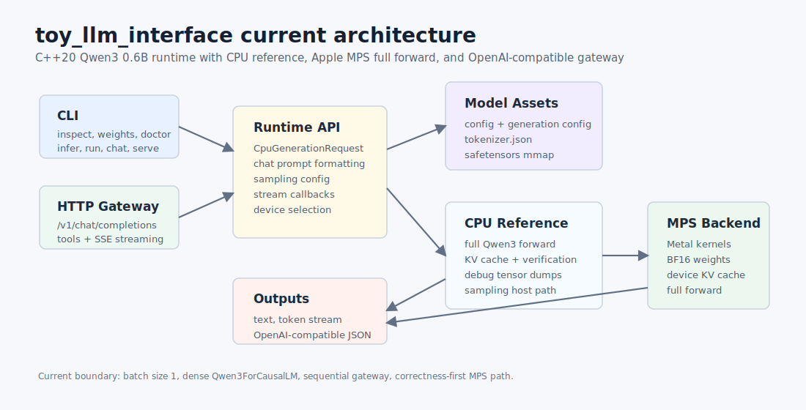

# Architecture

本文档记录当前实现状态，不再描述早期骨架计划。详细里程碑见
[`docs/milestones.md`](milestones.md)，每个阶段的 task checklist 见
`docs/M*/task.md`。



## Runtime Layers

当前 runtime 分为五层：

1. **CLI / Gateway**
   - CLI: `inspect`、`weights`、`doctor`、`infer`、`run`、`chat`、`serve`
   - HTTP: OpenAI-compatible `/v1/models`、`/v1/completions`、
     `/v1/chat/completions`
2. **Public inference API**
   - `CpuGenerationRequest`
   - chat messages / prompt
   - sampling config
   - stream token callback
   - device selection: `cpu` or `mps`
3. **Model assets**
   - Qwen3 config and generation config
   - tokenizer and chat prompt formatting
   - safetensors mmap reader
   - Qwen3 dense weight mapping and shape validation
4. **CPU reference backend**
   - correctness-first full forward
   - KV cache and verification
   - sampling host path
   - debug tensor dump
5. **MPS backend**
   - Objective-C++ Metal bridge
   - Metal buffers and pipelines
   - BF16 weights + F32 activations
   - full-forward kernels for Qwen3 0.6B

Apple framework types stay inside `.mm` implementation files. Public headers expose C++ types
only.

## CPU Reference Path

The CPU path is the correctness baseline:

```text
token ids
  -> embedding
  -> 28 x transformer layer
     -> input RMSNorm
     -> Q/K/V projection
     -> Q/K norm
     -> RoPE
     -> grouped-query attention over KV cache
     -> output projection + residual
     -> post-attention RMSNorm
     -> gate/up/down MLP + SiLU
     -> residual
  -> final RMSNorm
  -> lm_head logits
  -> sampling
```

It intentionally favors debuggability over speed. The MPS implementation is validated against
this path with smoke tests, KV cache verification, and optional debug tensor dumps.

## MPS Forward Path


MPS currently owns the main batch=1 forward path:

- embedding lookup
- RMSNorm
- Q/K/V/O/lm_head BF16 matvec
- Q/K norm
- RoPE
- K/V cache write and read
- GQA attention
- SiLU gate and MLP projection
- residual add

The host still performs token selection after logits are read back. That is the next obvious
performance boundary.

## Gateway Path


The gateway is intentionally small and dependency-free:

- sequential POSIX HTTP server
- request line/header/body parsing
- `Content-Length` request bodies
- `Connection: close`
- OpenAI-style JSON errors
- SSE streaming with `data: [DONE]`
- basic `tools` and `tool_choice` response protocol
- OpenAPI schema endpoint

The gateway does not execute tools. It returns `tool_calls`; the caller is responsible for
executing tools and sending `role: "tool"` messages back.

## Data Ownership

- Model weights are memory-mapped on CPU and uploaded to MPS buffers for MPS execution.
- CPU KV cache lives in `src/runtime/cpu/kv_cache.*`.
- MPS KV cache lives in the MPS workspace as device buffers.
- Debug dumps are opt-in and should stay under `build/` or another local output directory.
- Model files under `models/qwen3-0.6b/` are local assets and should not be committed.

## Current Boundaries

- Batch size is effectively `1`.
- The supported model family is dense `Qwen3ForCausalLM`.
- Qwen3.5 hybrid attention and MoE routing are not implemented.
- MPS is full-forward but still has many per-op command buffer waits.
- The HTTP gateway is not a production concurrent server.
- Usage token accounting in OpenAI-compatible responses is currently `0`.

## Next Architecture Work

Recommended next architecture slices:

- **M10 MPSGraph backend**
  - independent `mpsgraph` backend, not coupled to current `mps`
  - graph-side prefill/decode
  - device-resident weights and KV cache
  - graph-side greedy sampling
  - no prefill/decode CPU/GPU tensor round trips
- **M11 prompt cache / cache-control**
  - stable prefix token hashing
  - cross-request KV snapshots
  - LRU/TTL memory budget
  - optional cached last logits/hidden
- **M12 model family adapters**
  - Qwen3.5 text/hybrid attention support
  - optional MoE router/expert FFN path
  - per-model weight-name adapters
