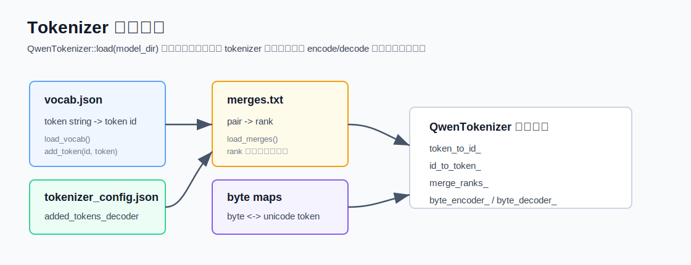
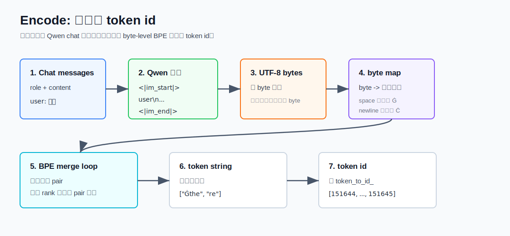
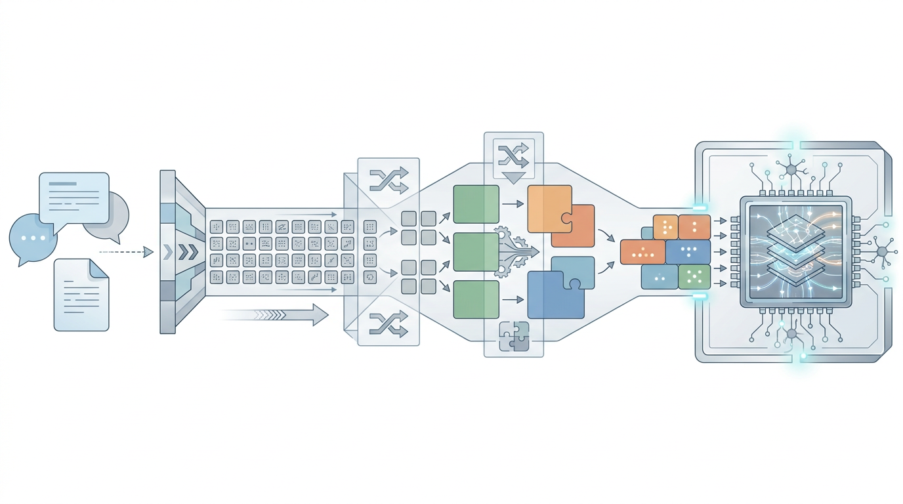
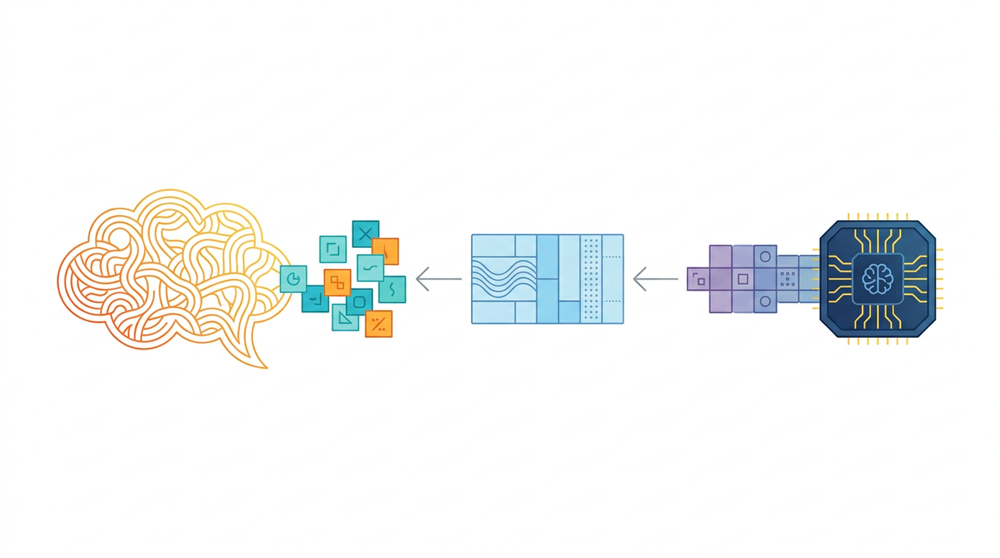
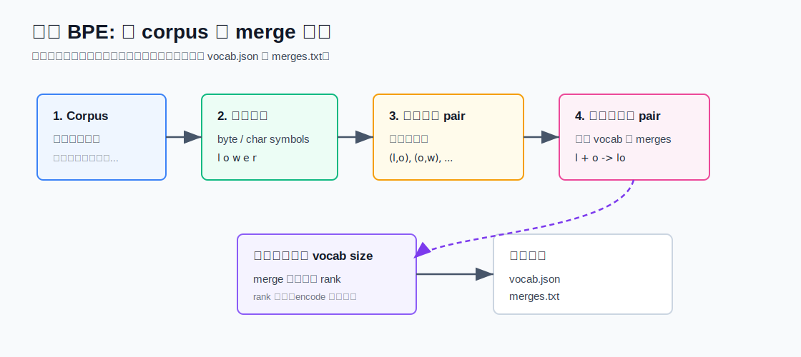
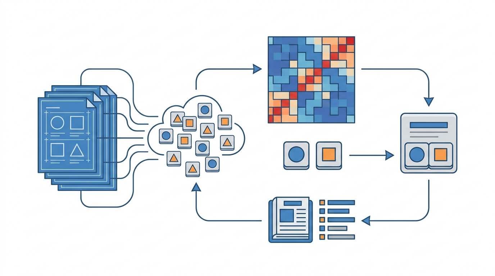
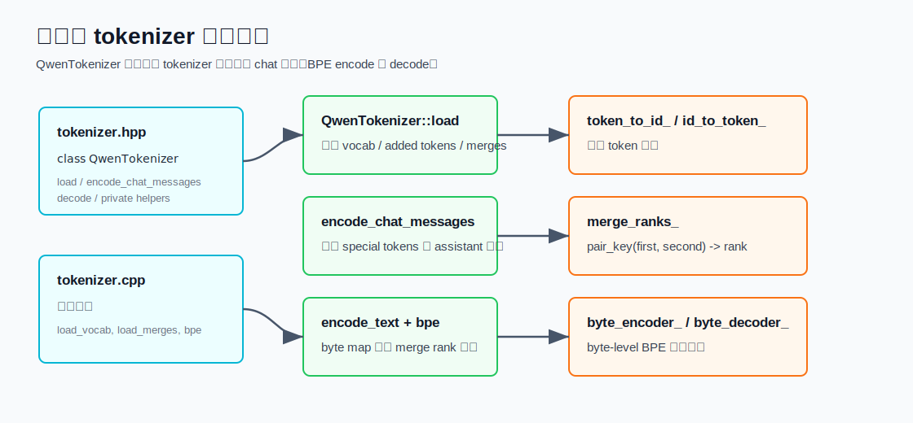

# 1. BPE Tokenizer

本文介绍 Qwen3 0.6B 在本项目里的 tokenizer 流程：模型目录里的 tokenizer 文件如何被
读取，文本如何被 encode 成 token id，BPE 在训练阶段如何学习“切分/合并”规则，最后
对照本项目的 C++ 实现说明每一步落在哪些函数里。

相关代码：

- [`src/runtime/cpu/tokenizer.hpp`](../../src/runtime/cpu/tokenizer.hpp)
- [`src/runtime/cpu/tokenizer.cpp`](../../src/runtime/cpu/tokenizer.cpp)
- [`src/runtime/cpu/tokens.hpp`](../../src/runtime/cpu/tokens.hpp)
- [`models/qwen3-0.6b/vocab.json`](../../models/qwen3-0.6b/vocab.json)
- [`models/qwen3-0.6b/merges.txt`](../../models/qwen3-0.6b/merges.txt)
- [`models/qwen3-0.6b/tokenizer_config.json`](../../models/qwen3-0.6b/tokenizer_config.json)

## Tokenizer 在推理链路中的位置

Qwen3 的完整推理链路可以简化成：

```text
messages / prompt
  -> tokenizer.encode
  -> token ids
  -> model prefill
  -> model decode
  -> generated token ids
  -> tokenizer.decode
  -> text
```

tokenizer 的职责不是“理解语义”，而是把字符串稳定地映射到整数 token id。模型只认识
这些整数 id；embedding lookup 也是按 token id 去取 `model.embed_tokens.weight` 的某一行。

## 读取 tokenizer 文件



`QwenTokenizer::load(model_dir)` 会读取三类文件：

```cpp
tokenizer.load_vocab(model_dir / "vocab.json");
tokenizer.load_added_tokens(model_dir / "tokenizer_config.json");
tokenizer.load_merges(model_dir / "merges.txt");
auto maps = build_byte_maps();
```

### vocab.json

`vocab.json` 是 token 字符串到 token id 的映射：

```text
"!": 0
"\"": 1
"Ġthe": 279
...
```

读取逻辑在 `load_vocab()`：

1. 读取 JSON object。
2. 每个 key 是 token 字符串，每个 value 是 token id。
3. 调用 `add_token(id, token)` 同时填充：
   - `token_to_id_[token] = id`
   - `id_to_token_[id] = token`

`id_to_token_` 是 vector，如果 id 超出当前长度，会 resize 到 `id + 1`。

### tokenizer_config.json

`tokenizer_config.json` 里有 `added_tokens_decoder`，用于补充 special tokens。例如：

```text
151643 -> <|endoftext|>
151644 -> <|im_start|>
151645 -> <|im_end|>
151667 -> <think>
151668 -> </think>
```

项目里相关常量定义在 `tokens.hpp`：

```cpp
constexpr std::int64_t kEndOfText = 151643;
constexpr std::int64_t kImStart = 151644;
constexpr std::int64_t kImEnd = 151645;
constexpr std::int64_t kThinkStart = 151667;
constexpr std::int64_t kThinkEnd = 151668;
```

读取逻辑在 `load_added_tokens()` 和 `parse_added_tokens_decoder()`：

1. 找到 JSON 字段 `added_tokens_decoder`。
2. 每个 key 是字符串形式的 token id。
3. 解析子对象里的 `content`。
4. 调用 `add_token(id, content)` 放入同一套 token 字典。

### merges.txt

`merges.txt` 是 BPE 合并规则表。文件顶部通常有版本注释：

```text
#version: 0.2
Ġ Ġ
ĠĠ ĠĠ
i n
Ġ t
...
```

每一行表示一个可合并的相邻 token pair。行号就是 rank，越靠前 rank 越小，encode 时
越优先合并。

读取逻辑在 `load_merges()`：

1. 跳过空行和 `#` 开头的注释。
2. 用第一个空格把一行拆成 `first` 和 `second`。
3. 用 `pair_key(first, second)` 生成 map key。
4. 写入 `merge_ranks_[pair] = rank++`。

`pair_key()` 使用 `'\x1f'` 作为内部连接符，避免简单字符串拼接产生歧义。

### byte maps

Qwen tokenizer 是 byte-level BPE。项目里 `build_byte_maps()` 构造：

- `byte_encoder_[256]`：raw byte -> 可见 unicode token 字符串。
- `byte_decoder_`：unicode codepoint -> raw byte。

这样做的原因是：任意 UTF-8 文本最终都是 byte 序列。只要 256 个 byte 都有映射，
tokenizer 就能覆盖任意输入，而不需要遇到未知字符就丢失信息。

常见现象：

- 空格常被映射成类似 `Ġ` 的可见符号。
- 换行常被映射成类似 `Ċ` 的可见符号。
- 中文字符会先变成多个 UTF-8 byte，再逐 byte 映射。

## Encode: 文本到 token id





本项目对 chat message 的 encode 分两层：

1. `encode_chat_messages()`：加 Qwen chat 模板和 special token。
2. `encode_text()` / `bpe()`：把普通文本 byte-level BPE 成 token id。

### Chat 模板

`encode_chat_messages(messages, enable_thinking)` 会遍历每条 message，只允许这些 role：

```text
system
user
assistant
```

每条消息会被拼成：

```text
<|im_start|>{role}
{content}<|im_end|>
```

对应代码结构：

```cpp
tokens.push_back(kImStart);
append_tokens(tokens, encode_text(message.role + "\n" + message.content));
tokens.push_back(kImEnd);
append_tokens(tokens, encode_text("\n"));
```

所有历史消息处理完后，再追加 assistant 开始标记：

```cpp
tokens.push_back(kImStart);
append_tokens(tokens, encode_text("assistant\n"));
```

如果 `enable_thinking == false`，会继续插入空 thinking block：

```cpp
tokens.push_back(kThinkStart);
append_tokens(tokens, encode_text("\n\n"));
tokens.push_back(kThinkEnd);
append_tokens(tokens, encode_text("\n\n"));
```

这一步影响的是 prompt 格式，不改变模型结构。

### Encode 的完整 token 序列展开

以一条 user message 为例：

```text
role    = user
content = hello
enable_thinking = false
```

`encode_chat_messages()` 生成的逻辑 token 序列是：

```text
[kImStart]
encode_text("user\nhello")
[kImEnd]
encode_text("\n")
[kImStart]
encode_text("assistant\n")
[kThinkStart]
encode_text("\n\n")
[kThinkEnd]
encode_text("\n\n")
```

其中方括号里的 special token 是直接 push token id；`encode_text(...)` 则会继续走
byte-level BPE。

因此 tokenizer 输出并不是只包含用户文本，而是包含完整对话边界：

```text
<|im_start|>user
hello<|im_end|>
<|im_start|>assistant
<think>

</think>

```

模型看到的是这整段 prompt 对应的 token ids。role、换行、assistant 起始标记都会影响
后续生成。

### Byte-level 初始切分

`encode_text(text)` 不直接按 Unicode 字符切分，而是按 C++ string 的 raw byte 切分：

```cpp
for (const auto ch : text) {
  word.push_back(byte_encoder_[static_cast<unsigned char>(ch)]);
}
```

例如：

```text
"A"       -> 1 个 byte
"hello"   -> 5 个 byte
"你好"    -> UTF-8 下通常是 6 个 byte
```

初始 `word` 是一个 token 字符串数组，每个元素来自 `byte_encoder_`。这保证任何输入都
可以被 tokenizer 表示。

更具体地说，C++ `std::string` 存的是 UTF-8 bytes，不是 Unicode codepoint 数组。
`encode_text()` 中的 `for (const auto ch : text)` 每次拿到一个 byte：

```text
text = "你"
UTF-8 bytes = E4 BD A0
初始 byte symbols = byte_encoder_[0xE4], byte_encoder_[0xBD], byte_encoder_[0xA0]
```

这些 byte symbols 看起来像 Unicode 字符，但它们只是 tokenizer 内部的可见占位符。
后续 BPE merge 可能把多个 byte symbols 合成一个更大的 token string。

### BPE merge loop

`bpe(word)` 会反复执行：

1. 扫描所有相邻 pair。
2. 在 `merge_ranks_` 中查这些 pair 是否可合并。
3. 找 rank 最小的 pair。
4. 合并这一处 pair。
5. 重复直到没有可合并 pair。

伪代码：

```text
while word.size > 1:
  best = none
  for i in 0..word.size-2:
    rank = merge_ranks[(word[i], word[i+1])]
    if rank exists and rank < best.rank:
      best = (i, rank)
  if best is none:
    break
  word = merge word[best.i] + word[best.i+1]
```

注意当前实现每轮只合并一个 `best_index`，然后重新扫描。这样写最直观，也方便对齐
rank 逻辑。

### Merge rank 如何决定切分

`merges.txt` 的越前面，rank 越小，优先级越高。encode 时不是按“当前文本里哪个 pair
出现次数最多”来合并；频次统计只发生在 tokenizer 训练阶段。推理阶段只看固定 rank。

一个简化例子：

```text
初始 word:
["Ġ", "t", "h", "e"]

merge_ranks:
("Ġ", "t")  -> rank 3
("t", "h")  -> rank 20
("Ġt", "h") -> rank 14
("Ġth", "e")-> rank 27
```

执行过程：

```text
第 1 轮: rank 最小的是 ("Ġ", "t")
["Ġ", "t", "h", "e"] -> ["Ġt", "h", "e"]

第 2 轮: 可用 pair 中 rank 最小的是 ("Ġt", "h")
["Ġt", "h", "e"] -> ["Ġth", "e"]

第 3 轮: 合并 ("Ġth", "e")
["Ġth", "e"] -> ["Ġthe"]
```

最后得到的 token string 是 `Ġthe`。这就是常见词片段会被压成更少 token 的原因。

当前实现每轮只合并一个最佳 pair。如果同一个最佳 pair 在同一轮出现多次，本实现不会
一次性全部合并，而是合并一次后重新扫描。结果仍然由 rank 表驱动，写法更容易阅读和调试。

### token string 到 token id

BPE 合并结束后，`word` 中每个元素都是一个 token string。最后一步查表：

```cpp
for (const auto& token : word) {
  const auto it = token_to_id_.find(token);
  if (it != token_to_id_.end()) {
    ids.push_back(it->second);
  }
}
```

输出就是 `std::vector<std::int64_t>` token ids，后续进入模型 embedding lookup。

正常情况下，byte-level 初始 token 和所有 merge 后 token 都应该能在 `vocab.json` 找到。
当前代码如果没找到某个 token string，会直接跳过它：

```cpp
if (it != token_to_id_.end()) {
  ids.push_back(it->second);
}
```

这不是通用 tokenizer 的严格错误处理，而是当前 Qwen3 0.6B runtime 的简化实现：它假设
本地 `vocab.json`、`merges.txt` 和 byte map 是匹配的。

## Decode: token id 到文本



`decode(ids)` 做反向映射：

1. 跳过 `kEndOfText`、`kImStart`、`kImEnd`。
2. 用 `id_to_token_[id]` 找 token string。
3. 把 token string 解析成 UTF-8 codepoints。
4. 用 `byte_decoder_` 把 codepoint 转回 raw byte。
5. 拼接 raw bytes 得到最终字符串。

当前 decode 明确跳过的是 end/im special tokens；其它 special token 是否显示，取决于
它们的 token string 是否能通过 byte decoder 转回普通 bytes。

### Decode 的完整过程展开

decode 的输入通常来自模型生成：

```text
generated token ids -> tokenizer.decode(ids)
```

每个 id 会先经过边界检查：

```cpp
if (id < 0 || static_cast<std::size_t>(id) >= id_to_token_.size()) {
  continue;
}
```

然后查表：

```cpp
token = id_to_token_[id]
```

token string 不是最终文本，它还是 byte-level BPE 的内部符号。例如：

```text
id -> "Ġthe"
id -> "llo"
id -> 某些由 byte_encoder_ 生成的 unicode 占位符
```

`decode()` 会把 token string 解析成 UTF-8 codepoints，再用 `byte_decoder_` 还原 raw
bytes：

```text
token string
  -> utf8_codepoints(token string)
  -> byte_decoder_[codepoint]
  -> raw bytes
```

最后把 raw bytes 拼成 `std::string`。如果这些 bytes 是合法 UTF-8，终端或浏览器就会把
它显示成正常文本。

### 为什么 decode 能还原中文

中文 token 在 encode 时可能被拆成多个 UTF-8 byte，也可能被 BPE merge 成更大的 token。
decode 时不关心它当初怎么分片，只要最终 token string 能通过 `byte_decoder_` 还原出原始
UTF-8 bytes，就能重新组成中文。

例如概念上：

```text
token ids
  -> token strings
  -> bytes: E4 BD A0
  -> UTF-8 string: 你
```

### Special token 的处理

当前 decode 显式跳过：

```text
151643 <|endoftext|>
151644 <|im_start|>
151645 <|im_end|>
```

`<think>` 和 `</think>` 没有在 `decode()` 里硬编码跳过。如果模型真的生成这些 token，
它们可能会作为普通文本片段进入输出。上层是否展示 thinking 内容，由 prompt formatting
和调用侧策略共同决定。

### Streaming decode 的边界

生成时如果开启 streaming，代码会对每个新 token 单独 decode：

```cpp
const auto token_text = tokenizer_.decode(std::vector<std::int64_t>{next_token});
stream_token(token_text);
```

byte-level tokenizer 在绝大多数常见 token 上可以正常输出，但理论上一个 Unicode 字符的
UTF-8 bytes 可能跨 token 分布。此时按单 token decode 可能出现临时半字符或不可见片段；
等后续 token 到来后，完整 bytes 才能组成最终字符。

## BPE 训练时如何学习切分





训练 tokenizer 不在本项目里做；项目只消费训练好的 `vocab.json` 和 `merges.txt`。
但理解训练过程有助于理解 `merges.txt` 的来源。

典型 byte-level BPE 训练流程：

1. 收集大规模 corpus。
2. 把文本转成 byte-level 初始符号序列。
3. 统计所有相邻符号 pair 的频次。
4. 选择最高频 pair，把它合并成新 token。
5. 把新 token 加入 vocab，并把这条 merge 写入 merges。
6. 重复直到达到目标 vocab size。

一个简化例子：

```text
corpus word: lower
初始切分: l o w e r

如果 (l, o) 最高频:
l o w e r -> lo w e r

如果 (lo, w) 后续也高频:
lo w e r -> low e r

如果 (e, r) 高频:
low e r -> low er
```

训练阶段决定“哪些 pair 应该合并”和“合并优先级”。推理阶段不会再重新统计频次，只按
`merges.txt` 中固定的 rank 执行合并。

### 为什么常见词会变短

BPE 的效果是：高频片段会逐步成为更长 token。

例如英文中常见的：

```text
Ġ + t -> Ġt
Ġt + h -> Ġth
Ġth + e -> Ġthe
```

这里 `Ġ` 常代表空格。最终 `" the"` 可能被编码成一个 token `Ġthe`，比按字符或按 byte
更短。

### 为什么罕见词也能表示

即使某个词没有完整 token，byte-level BPE 仍能退回到更小的 byte token：

```text
罕见字符串
  -> UTF-8 bytes
  -> byte-level symbols
  -> 能合并多少合并多少
  -> 剩余 byte token 仍能查到 id
```

这就是 byte-level BPE 的核心优势：覆盖面强，不需要真正的 `<unk>` 才能表示任意文本。

## 本项目代码实现



### 类结构

`QwenTokenizer` 的公开接口很小：

```cpp
class QwenTokenizer {
 public:
  static QwenTokenizer load(const std::filesystem::path& model_dir);
  std::vector<std::int64_t> encode_chat_messages(const std::vector<ChatMessage>& messages,
                                                 bool enable_thinking);
  std::string decode(const std::vector<std::int64_t>& ids) const;
};
```

内部状态：

```cpp
std::array<std::string, 256> byte_encoder_;
std::unordered_map<std::uint32_t, unsigned char> byte_decoder_;
std::unordered_map<std::string, std::int64_t> token_to_id_;
std::vector<std::string> id_to_token_;
std::unordered_map<std::string, int> merge_ranks_;
```

这些结构分别对应：

- byte 与可见 token 字符之间的可逆映射。
- token string 到 token id 的查表。
- token id 到 token string 的反查。
- BPE pair 到 merge rank 的查表。

### load_vocab()

`load_vocab()` 使用项目内的 `JsonScanner` 直接扫 `vocab.json`，不依赖第三方 JSON 库。
每读到一个 `"token": id` 就调用 `add_token()`。

这个函数建立 tokenizer 最核心的 token 字典。

### load_added_tokens()

`load_added_tokens()` 只关心 `tokenizer_config.json` 里的 `added_tokens_decoder`，其它字段
用 `skip_value()` 跳过。

这让实现保持很小，但也意味着当前 tokenizer 没有完整解释 Hugging Face tokenizer
配置里的所有字段；它只实现当前推理需要的部分。

### load_merges()

`load_merges()` 逐行读取 `merges.txt`：

```cpp
if (line.empty() || line[0] == '#') continue;
split = line.find(' ');
merge_ranks_[pair_key(first, second)] = rank++;
```

rank 是递增整数。越早出现的 merge 规则，rank 越小，BPE encode 时优先级越高。

### build_byte_maps()

`build_byte_maps()` 的逻辑接近 GPT-2/RoBERTa 的 byte encoder：

1. 先保留一批可打印字节：
   - `33..126`
   - `161..172`
   - `174..255`
2. 其它 byte 映射到 `256 + extra` 之后的 Unicode codepoint。
3. 生成 `byte_encoder_` 和 `byte_decoder_`。

这样可以把空格、换行、控制字符等不可见 byte 映射成 tokenizer 内部可见的符号。

### encode_chat_messages()

这个函数完成 Qwen chat prompt 的拼装。它不做复杂模板解析，而是直接按项目需要构造：

```text
<|im_start|>{role}
{content}<|im_end|>
...
<|im_start|>assistant
```

当 thinking 关闭时，插入：

```text
<think>

</think>

```

这样 Qwen3 会倾向于不输出 thinking 内容。

### encode_text()

`encode_text()` 把 C++ string 每个 byte 映射为初始 token string，再调用 `bpe()`：

```cpp
std::vector<std::string> word;
for (const auto ch : text) {
  word.push_back(byte_encoder_[static_cast<unsigned char>(ch)]);
}
return bpe(word);
```

注意这里按 byte，不按 Unicode 字符。中文、emoji 等多字节字符会先拆成多个 byte-level
symbol。

### bpe()

`bpe()` 是当前 tokenizer 的核心：

- 输入：byte-level token string 数组。
- 循环：找 rank 最小的相邻 pair。
- 合并：把这两个 token string 拼接成一个新 token string。
- 输出：查 `token_to_id_` 得到 token id。

当前实现优点是简单、可读、便于 debug；缺点是没有 cache，也没有对长文本做复杂优化。

### decode()

`decode()` 反向执行：

```cpp
id -> token string -> codepoints -> bytes -> std::string
```

它会跳过 `<|endoftext|>`、`<|im_start|>`、`<|im_end|>`，避免模型输出里混入 chat 边界
标记。

## 和模型 forward 的关系

tokenizer encode 的输出进入 CPU forward：

```text
token id
  -> embedding lookup
  -> decoder layers
  -> logits
  -> next token id
```

生成得到的 token id 再调用 tokenizer decode，变回用户可读文本。

因此 tokenizer 的稳定性直接影响模型输入：

- chat 模板不一致会改变 prompt token 序列。
- merges/vocab 不一致会改变 token id。
- special token id 不一致会改变模型对 role、EOS、thinking 的理解。

本项目 tokenizer 的目标不是实现通用 tokenizer 框架，而是实现足够准确、可读、可调试的
Qwen3 0.6B 推理 tokenizer。
