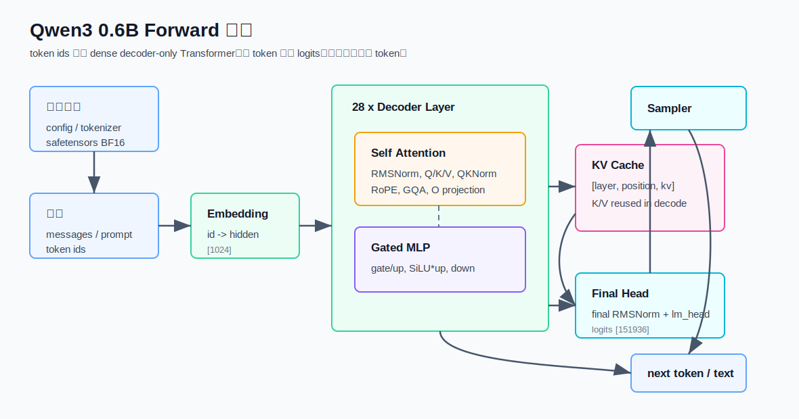

# 2. Qwen3 Forward 推理整体架构

本文介绍本项目里 `Qwen/Qwen3-0.6B` 的 forward 推理整体架构。它关注“数据如何流过
模型”，不展开每个算子的全部数学细节；更底层的 CPU 算子和 KV cache 细节见
[`../forward.md`](../forward.md)。

相关代码：

- [`src/runtime/cpu/qwen_cpu_model.cpp`](../../src/runtime/cpu/qwen_cpu_model.cpp)
- [`src/runtime/cpu_inference.cpp`](../../src/runtime/cpu_inference.cpp)
- [`src/runtime/cpu/kv_cache.cpp`](../../src/runtime/cpu/kv_cache.cpp)
- [`src/model/model_config.cpp`](../../src/model/model_config.cpp)
- [`src/backends/mps/mps_backend.mm`](../../src/backends/mps/mps_backend.mm)

## 整体视图



Qwen3 0.6B 是 dense decoder-only Transformer。推理时输入不是原始字符串，而是 tokenizer
产生的 token ids。模型每次根据已有上下文预测下一个 token：

```text
messages / prompt
  -> tokenizer
  -> token ids
  -> embedding
  -> 28 x decoder layer
  -> final RMSNorm
  -> lm_head logits
  -> sampler
  -> next token id
  -> tokenizer.decode
```

decode 阶段会不断重复：

```text
last hidden -> logits -> sample next token -> forward next token -> new hidden
```

## 模型结构参数

当前目标模型配置：

```text
Architecture: Qwen3ForCausalLM
Layers: 28
Hidden size: 1024
Attention heads: 16
KV heads: 8
Head dim: 128
Attention dim: 16 * 128 = 2048
KV dim: 8 * 128 = 1024
Intermediate size: 3072
Vocab size: 151936
DType: bfloat16 weights, float32 activations
RoPE theta: 1000000
RMSNorm eps: 1e-6
```

这几个维度决定了 forward 的主要张量形状：

```text
token id               scalar
hidden                 [1024]
q                      [16, 128] = [2048]
k / v                  [8, 128] = [1024]
attention output       [16, 128] = [2048]
MLP intermediate       [3072]
logits                 [151936]
```

## Runtime 层次

本项目的 forward 不是单个函数，而是几层共同完成：

```text
CLI / HTTP gateway
  -> CpuGenerationRequest
  -> generate_cpu()
  -> cpu::generate_text()
  -> CpuQwenModel::generate()
  -> forward_token()
  -> apply_layer()
```

其中：

- `generate_cpu()` 是公开 C++ API 入口。
- `CpuQwenModel::load()` 负责加载 config、tokenizer、safetensors。
- `CpuQwenModel::generate()` 管理 prefill、decode、sampling、stream callback。
- `forward_token()` 负责单 token 通过完整 Qwen3 模型。
- `apply_layer()` 负责一个 decoder layer。

`cached_model(model_dir)` 会缓存已经加载的模型对象，避免同一个模型目录每次请求都重新
解析权重。

## 模型加载架构

加载阶段做三件事：

```text
1. load_model_bundle(model_dir)
   -> config.json
   -> generation_config.json
   -> tokenizer metadata

2. QwenTokenizer::load(model_dir)
   -> vocab.json
   -> tokenizer_config.json
   -> merges.txt

3. SafeTensorMap::load(model.safetensors)
   -> mmap 权重文件
   -> bind_weights()
```

`bind_weights()` 会把 safetensors 里的权重名绑定成内部结构：

```text
embedding_
final_norm_
lm_head_
layers_[0..27]
```

每个 `layers_[i]` 包含：

```text
input_norm
q_proj, q_norm
k_proj, k_norm
v_proj
o_proj
post_norm
gate_proj, up_proj, down_proj
```

这样 forward 时就不需要再按字符串查找权重名。

## Prefill 和 Decode

### Prefill

prefill 阶段处理 prompt tokens：

```text
for token in prompt_tokens:
  hidden = forward_token(token, position)
  position += 1
```

当前实现为了简单和可调试，prefill 也是逐 token forward，没有把整个 prompt 变成一次
batched GEMM。

prefill 的关键副作用是写 KV cache：

```text
每个 prompt token
  每一层
    写入 K/V 到 KV cache
```

这样 decode 第一步就能直接 attend 到完整 prompt。

### Decode

decode 阶段每轮只处理一个新 token：

```text
logits = compute_logits(last_hidden)
next_token = select_next_token(logits)
hidden = forward_token(next_token, position)
position += 1
```

每个新 token 的 K/V 会追加进 cache。下一轮 attention 读取的范围也随之扩大。

## 单 Token Forward 架构

`forward_token(token, position)` 的架构：

```text
embedding lookup
  -> layer 0
  -> layer 1
  -> ...
  -> layer 27
  -> final RMSNorm
  -> return hidden
```

embedding lookup 把 token id 映射到 hidden vector：

```text
hidden[i] = embed_tokens[token_id, i]
```

权重是 BF16，CPU path 会读取时转换成 F32。

## Decoder Layer 架构

每个 decoder layer 分成两个大块：

```text
Attention block
MLP block
```

### Attention block

attention block：

```text
x
  -> input RMSNorm
  -> q_proj / k_proj / v_proj
  -> q_norm / k_norm
  -> RoPE(q, k)
  -> store k/v to KV cache
  -> grouped-query attention over KV cache
  -> o_proj
  -> residual add
```

关键点：

- Q 有 16 个 heads。
- K/V 有 8 个 heads。
- 每 2 个 Q head 共享 1 个 KV head。
- RoPE 只作用在 Q/K。
- attention 只看 `0..position`，自然满足 causal。

### MLP block

MLP block：

```text
x
  -> post-attention RMSNorm
  -> gate_proj
  -> up_proj
  -> SiLU(gate) * up
  -> down_proj
  -> residual add
```

MLP intermediate size 是 `3072`，最后通过 `down_proj` 回到 hidden size `1024`。

## KV Cache 在架构中的位置

KV cache 是 decode 推理的核心状态。逻辑形状：

```text
keys   [layers, capacity_tokens, kv_heads, head_dim]
values [layers, capacity_tokens, kv_heads, head_dim]
```

对 Qwen3 0.6B：

```text
keys   [28, capacity_tokens, 8, 128]
values [28, capacity_tokens, 8, 128]
```

每个 token 进入某一层时，先计算当前 token 的 K/V，然后写 cache：

```text
cache[layer, position] = current K/V
```

attention 计算时读取：

```text
cache[layer, 0..position]
```

这避免 decode 每一步都重新计算历史 token 的 K/V。CPU 版本的 cache 是 F32
`std::vector<float>`，MPS 版本的 cache 在 device buffer 里。

## Logits 和 Sampling

全部 decoder layer 完成后，先做 final RMSNorm，再过 `lm_head`：

```text
normed = RMSNorm(hidden, model.norm.weight)
logits = lm_head * normed
```

`logits` shape 是 `[151936]`，每个位置对应一个 vocab token id 的分数。

sampler 根据配置选择下一个 token：

- greedy：选最大 logit。
- sampling：temperature + top-k + top-p。

如果采样结果命中 EOS，生成停止；否则把新 token 追加到 generated tokens，并继续
下一轮 decode。

## CPU 和 MPS 的架构关系

当前项目里 CPU 和 MPS 共享同一套高层生成逻辑：

```text
prompt formatting
sampling config
stream callback
EOS handling
KV cache stats
verification flow
```

区别在 forward 计算在哪里执行：

- CPU path：权重 mmap 在 CPU，算子用 C++ vector/loop 实现，是 correctness reference。
- MPS path：权重上传到 Metal buffer，embedding、RMSNorm、matvec、RoPE、attention、
  MLP、KV cache 等主 forward 算子在 MPS 上执行。

MPS path 生成 logits 后仍会读回 CPU 做 sampling。这是当前架构里的一个性能边界。

## Debug 和验证入口

为了让 forward 可以对齐和排错，项目提供：

- `--dump-dir`：导出 embedding、Q/K/V、RoPE、attention、MLP、logits 等中间张量。
- `--verify-kv-cache`：用 full-prefix recompute 对比 cached decode 的 token 输出。
- `weights` / `doctor`：检查 config、tokenizer、safetensors shape 和 Qwen3 权重映射。

这些能力让 CPU path 可以作为 MPS 或后续 backend 的逐算子参考。

## 当前边界

当前 forward 架构的边界：

- batch size 主要是 `1`。
- prefill 仍然是 token-wise，没有 sequence GEMM。
- 目标是 dense `Qwen3ForCausalLM`。
- 不支持 Qwen3.5 hybrid attention。 
- 不支持 MoE expert routing。
- CPU KV cache 是 F32 contiguous vector，没有 paged/quantized KV。
- MPS 已支持 full-forward，但采样仍在 CPU host。

这个设计让项目先把 Qwen3 0.6B 的完整本地推理链路跑通，再逐步替换和优化性能热点。
