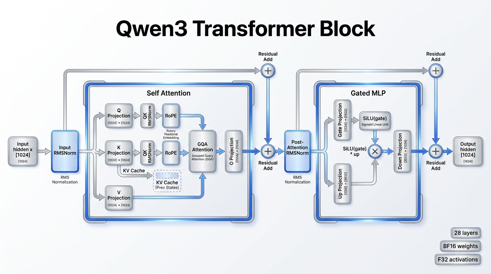
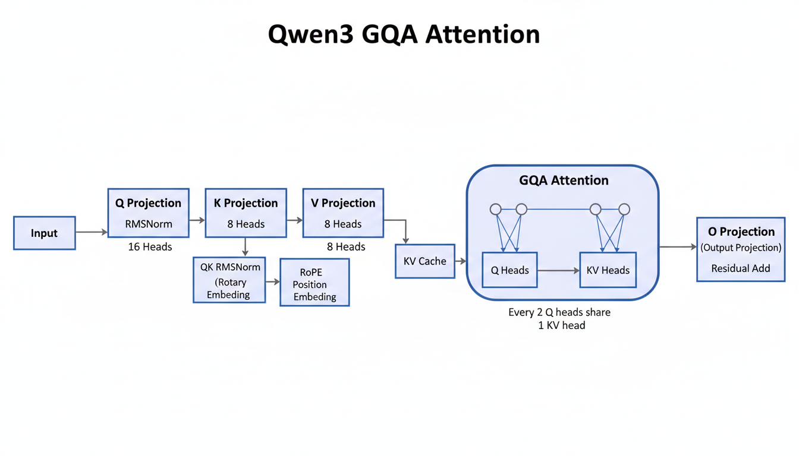
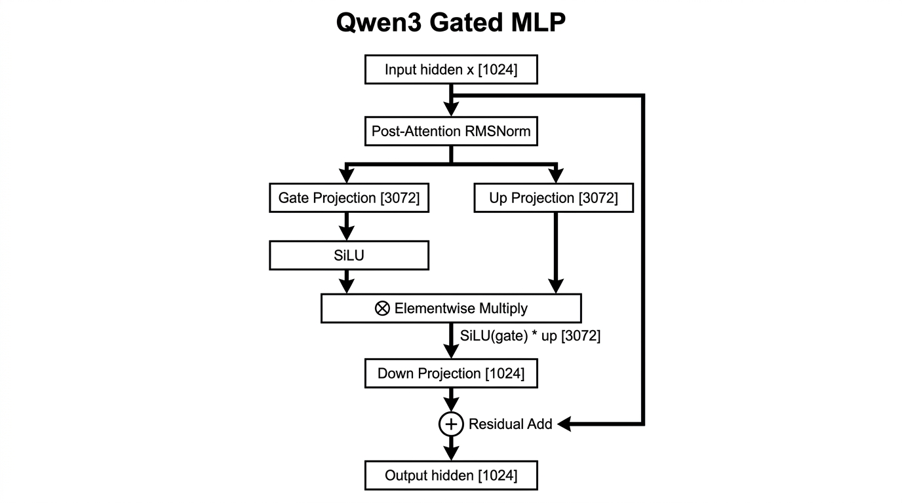

# 3. Qwen3 Transformer 模块

本文详细介绍 Qwen3 0.6B 里真正执行语义计算的 Transformer 模块，也就是
`model.layers.0..27` 这 28 个 decoder layer。Tokenizer 负责把文本变成 token id，
embedding 负责把 token id 变成 hidden vector；Transformer block 则负责把当前 hidden
和历史上下文融合起来，得到下一步预测所需的表示。

相关代码：

- [`src/runtime/cpu/qwen_cpu_model.cpp`](../../src/runtime/cpu/qwen_cpu_model.cpp)
- [`src/runtime/cpu/kv_cache.cpp`](../../src/runtime/cpu/kv_cache.cpp)
- [`models/qwen3-0.6b/config.json`](../../models/qwen3-0.6b/config.json)

## 模块总览



Qwen3 0.6B 的每个 Transformer layer 都是 decoder-only block，结构可以概括为：

```text
x
  -> input RMSNorm
  -> self-attention
  -> residual add
  -> post-attention RMSNorm
  -> gated MLP
  -> residual add
  -> y
```

它是 pre-norm 结构：attention 和 MLP 之前都先做 RMSNorm，然后子模块输出再加回残差。
这样每个子模块都处理归一化后的输入，而残差路径保留原始 hidden。

对 Qwen3 0.6B，关键维度是：

```text
hidden size H          = 1024
num layers L           = 28
query heads Nq         = 16
kv heads Nkv           = 8
head dim D             = 128
attention dim A        = Nq * D = 2048
kv dim KVD             = Nkv * D = 1024
MLP intermediate I     = 3072
```

每一层结构完全相同，但权重不同。第 0 层和第 27 层没有特殊分支；差异只来自
`model.layers.{i}.*` 绑定到不同权重。

## 一个 token 的 hidden 是怎么计算出来的

对位置 `p` 的 token，Transformer 真正要算的是这个 token 在每一层里的 hidden state。
可以把它写成：

```text
token id
  -> embedding
  -> x^(0)
  -> Block_0
  -> x^(1)
  -> Block_1
  -> ...
  -> Block_27
  -> x^(28)
  -> final RMSNorm
  -> h_p
```

其中：

- `x^(0)` 是 embedding lookup 得到的初始 hidden
- `x^(l)` 是第 `l` 层输入
- `x^(l+1)` 是第 `l` 层输出
- `h_p` 是最终用于 `lm_head` 计算 logits 的 hidden

本项目里，单 token hidden 的入口就是 `forward_token()`：

```cpp
std::vector<float> hidden(hidden_size);
for (std::size_t i = 0; i < hidden_size; ++i) {
  hidden[i] = bf16_to_float(embedding_.data,
                            static_cast<std::uint64_t>(token) *
                              static_cast<std::uint64_t>(hidden_size) + i);
}

for (std::size_t layer_index = 0; layer_index < layers_.size(); ++layer_index) {
  apply_layer(layers_[layer_index], layer_index, position, hidden);
}

rms_norm(hidden, final_norm_, normed);
return normed;
```

也就是：

```text
hidden = embedding[token]
hidden = layer_0(hidden, cache[0..p])
hidden = layer_1(hidden, cache[0..p])
...
hidden = layer_27(hidden, cache[0..p])
h_p = final_rms_norm(hidden)
```

这里最关键的一点是：`hidden` 不是一开始就带上下文信息。它先只是当前 token 的 embedding，
然后在每一层的 attention 里去读取历史 KV cache，逐层把“前面 token 的信息”混进来。

所以如果只看某个位置 `p` 的最终 hidden，本质上它是：

```text
h_p = F(token_p, token_0, token_1, ..., token_{p-1})
```

未来 token `token_{p+1} ...` 不会进入这个函数的依赖集合。

## 在代码中的调用顺序

CPU reference path 里，单 token forward 的层循环是：

```cpp
for (std::size_t layer_index = 0; layer_index < layers_.size(); ++layer_index) {
  apply_layer(layers_[layer_index], layer_index, position, hidden);
}
```

`apply_layer()` 的计算顺序可以写成：

```text
normed = RMSNorm(hidden, input_layernorm)
q = q_proj * normed
k = k_proj * normed
v = v_proj * normed
q = QKNorm(q, q_norm)
k = QKNorm(k, k_norm)
q = RoPE(q, position)
k = RoPE(k, position)
store_kv(layer, position, k, v)
attn_out = Attention(q, kv_cache[layer, 0..position])
projected = o_proj * attn_out
hidden = hidden + projected

normed = RMSNorm(hidden, post_attention_layernorm)
gate = gate_proj * normed
up = up_proj * normed
mlp = SiLU(gate) * up
down = down_proj * mlp
hidden = hidden + down
```

这个顺序很重要：KV cache 存的是已经做过 Q/K norm 和 RoPE 的 K，以及没有 RoPE 的 V。
attention 读取 cache 时不再重新计算历史 token 的 K/V。

## Prefill 是怎么计算的

生成时可以分成两个阶段：

1. `prefill`：把整段 prompt 喂进去，建立 KV cache
2. `decode`：基于最后一个 hidden 出 logits，采样新 token，再继续一步一步向前推

本项目 CPU path 的主循环是：

```cpp
std::vector<float> hidden;
std::size_t position = 0;
{
  for (const auto token : prompt_tokens) {
    hidden = forward_token(token, position);
    ++position;
  }
}

for (std::size_t step = 0; step < max_new_tokens; ++step) {
  const auto logits = compute_logits(hidden, false);
  const auto next_token = select_next_token(logits, rng, effective_sampling);
  hidden = forward_token(next_token, position);
  ++position;
}
```

### prefill 的输入和输出

假设 prompt token 序列是：

```text
[t0, t1, t2, t3]
```

那么 prefill 做的是：

```text
position=0: h0 = forward_token(t0, 0)
position=1: h1 = forward_token(t1, 1)
position=2: h2 = forward_token(t2, 2)
position=3: h3 = forward_token(t3, 3)
```

每做一次 `forward_token(tp, p)`，都会发生两件事：

1. 算出当前位置 `p` 的最终 hidden `h_p`
2. 把该位置在每一层的 `K/V` 写进对应 layer 的 KV cache

所以当 prefill 结束时：

- cache 里已经有 `t0..t3` 的全部历史 K/V
- `hidden` 保存的是最后一个 prompt token，也就是 `t3` 的最终 hidden

这个 `hidden` 会立刻送进 `lm_head`，得到“下一个 token”的 logits。也就是说，decode
第一步并不是重新把 prompt 算一遍，而是直接使用 prefill 最后留下来的结果。

### prefill 为什么必要

如果没有 prefill，那么在生成第一个新 token 之前，模型根本没有：

- 最后一个 prompt token 的 hidden
- 各层历史 token 的 KV cache

也就无法正确计算：

```text
P(next_token | prompt)
```

prefill 的本质就是把条件上下文一次性灌进模型内部状态里。

### prefill 和 decode 的差别

两者内部都调用同一个 `forward_token()`，Transformer block 本身没有“prefill 专用公式”。
区别只在调度方式：

- `prefill`：对 prompt 中每个已有 token 顺序执行 forward，不做采样
- `decode`：先用上一步 hidden 出 logits，再采样一个新 token，然后只对这个新 token 做一次 forward

可以写成：

```text
prefill:
  t0 -> forward
  t1 -> forward
  ...
  tN -> forward

decode:
  hN -> logits -> sample(tN+1)
  tN+1 -> forward
  hN+1 -> logits -> sample(tN+2)
  ...
```

这也是 KV cache 能加速生成的原因：decode 阶段不需要把旧 token 全部重新过一遍 block。

## Attention 子模块



attention block 是 Transformer layer 里负责“看上下文”的部分。它把当前 token 的 hidden
映射成 query，同时把当前 token 的 key/value 写进 cache，然后让 query 到历史 cache 里
查找相关信息。

### 1. Input RMSNorm

attention 前先做 RMSNorm：

```text
a = RMSNorm(x, input_layernorm.weight)
```

shape：

```text
x: [1024]
a: [1024]
```

RMSNorm 只按均方根归一化，不计算均值：

```text
rms = sqrt(mean(x_i^2) + eps)
out_i = x_i / rms * weight_i
```

Qwen3 0.6B 的 `rms_norm_eps = 1e-6`。

### 2. Q/K/V Projection

归一化后的 hidden 进入三个 projection：

```text
q = q_proj * a
k = k_proj * a
v = v_proj * a
```

权重和输出 shape：

```text
q_proj: [2048, 1024] -> q: [2048] = [16, 128]
k_proj: [1024, 1024] -> k: [1024] = [8, 128]
v_proj: [1024, 1024] -> v: [1024] = [8, 128]
```

这里可以看到 Qwen3 0.6B 的 attention dimension 是 `2048`，大于 hidden size `1024`。
Q 有 16 个 head，K/V 只有 8 个 head。

### 3. Q/K Norm

Qwen3 在 Q/K projection 后还会对每个 head 做 RMSNorm：

```text
q = QKNorm(q, q_norm.weight)
k = QKNorm(k, k_norm.weight)
```

`q_norm.weight` 和 `k_norm.weight` 的 shape 都是 `[128]`，在每个 head 上复用。
V 不做 Q/K norm。

这一步让 Q/K 的尺度更稳定，有利于后面的 dot-product attention。

### 4. RoPE

RoPE 只作用在 Q 和 K：

```text
q = RoPE(q, position)
k = RoPE(k, position)
```

V 不带位置信息。原因是 attention score 由 Q/K dot product 决定，位置信息应该影响“看
哪里”；一旦权重算出来，V 只是被加权汇总的内容。

本项目实现使用 half-rotation：

```text
values[i]        = x0 * cos(angle) - x1 * sin(angle)
values[half + i] = x1 * cos(angle) + x0 * sin(angle)
```

### 5. KV Cache 写入

当前 token 的 K/V 写入 cache：

```text
keys[layer, position, :] = k
values[layer, position, :] = v
```

逻辑形状：

```text
keys   [28, capacity_tokens, 8, 128]
values [28, capacity_tokens, 8, 128]
```

prefill 阶段会把 prompt 的所有 token 写进去；decode 阶段每次追加一个新 token。

### 6. Grouped-Query Attention

Qwen3 0.6B 使用 GQA：

```text
Nq = 16
Nkv = 8
group = Nq / Nkv = 2
kv_head = q_head / group
```

也就是：

```text
Q head 0,1   -> KV head 0
Q head 2,3   -> KV head 1
...
Q head 14,15 -> KV head 7
```

每个 query head 对自己的 KV head 做 causal attention：

```text
score[t] = dot(q_head, key[layer, t, kv_head]) / sqrt(128)
t = 0..position
```

只遍历 `0..position`，所以不需要额外 causal mask；未来 token 根本不会进入 score 数组。

softmax 后汇总 value：

```text
out[q_head, d] = sum_t softmax(score[t]) * value[layer, t, kv_head, d]
```

attention 输出 shape：

```text
attn_out: [16, 128] = [2048]
```

## 为什么它只能看前面的 token

这是 decoder-only 自回归模型最核心的约束。对位置 `p`，模型只能依赖：

```text
token_0, token_1, ..., token_p
```

不能依赖：

```text
token_{p+1}, token_{p+2}, ...
```

否则训练和推理都会“偷看答案”。

### 数学上对应的是 causal mask

标准 Transformer 教科书里，attention score 矩阵通常写成：

```text
S = Q K^T / sqrt(D)
```

然后加一个上三角 mask：

```text
S_ij = -inf, when j > i
```

再做 softmax。这样第 `i` 行只会保留 `0..i` 的位置。

### 本项目的增量解码实现没有显式 mask，但效果完全一样

这里不是先构造完整 `[seq, seq]` score 矩阵再加 mask，而是直接在单 token 推理时，只遍历
历史位置：

```cpp
std::vector<float> scores(position + 1U);
for (std::size_t t = 0; t <= position; ++t) {
  const auto* key = kv_cache_.key_ptr(layer, t, kv_head);
  float score = 0.0F;
  for (std::size_t d = 0; d < head_dim; ++d) {
    score += q[q_base + d] * key[d];
  }
  scores[t] = score * scale;
}
```

这里有两个决定性限制：

1. `scores` 只分配了 `position + 1` 个槽位
2. 循环只跑 `t = 0 .. position`

所以当前位置 `p` 的 query 根本不会去访问 `p+1` 以后的 K/V。

### future token 为什么根本不存在

更进一步说，在增量推理里，未来 token 的 K/V 连 cache 都还没写进去。

当前 token 的执行顺序是：

```text
1. 当前 token 做 q/k/v projection
2. 当前 token 的 k/v 写入 cache[position]
3. query 读取 cache[0..position]
```

此时：

```text
cache[position+1], cache[position+2], ...
```

还不存在。于是“只看前面”不仅是逻辑约束，也是当前数据结构的物理约束。

### 对 prefill 逐位置展开后会更直观

假设 prompt 是：

```text
[t0, t1, t2, t3]
```

prefill 时每个位置实际看到的是：

```text
position 0: t0                    只能看 [t0]
position 1: t1 的 query          只能看 [t0, t1]
position 2: t2 的 query          只能看 [t0, t1, t2]
position 3: t3 的 query          只能看 [t0, t1, t2, t3]
```

绝不会出现：

```text
position 1 去看 t2 或 t3
```

因为那两个位置在 `position=1` 这一时刻还没写入 cache。

### 所以“只看前面”真正发生在 attention

embedding、RMSNorm、MLP 都是单 token 局部算子；它们不读取其它位置。真正把上下文混进
当前 hidden 的地方，就是 attention 读取 KV cache 的这一步。

因此可以非常精确地说：

```text
上下文依赖来自 attention
因果约束也由 attention 里的历史读取范围保证
```

这也是为什么 KV cache 只会影响 attention，而不会影响 embedding 或 MLP。

### 7. O Projection 和残差

attention 输出还不是 hidden size，需要经过 `o_proj`：

```text
projected = o_proj * attn_out
```

shape：

```text
o_proj: [1024, 2048]
projected: [1024]
```

然后做第一条残差：

```text
x1 = x + projected
```

这一层 attention block 到这里结束。

## Gated MLP 子模块



MLP block 负责对每个 token 的 hidden 做非线性变换。它不直接读取其它 token；上下文融合
已经由 attention 完成。Qwen3 使用 gated MLP，而不是单纯的两层 FFN。

### 1. Post-Attention RMSNorm

attention residual 后的 hidden 先归一化：

```text
m = RMSNorm(x1, post_attention_layernorm.weight)
```

shape：

```text
x1: [1024]
m:  [1024]
```

### 2. Gate Projection 和 Up Projection

归一化后的 hidden 分成两条投影路径：

```text
gate = gate_proj * m
up = up_proj * m
```

shape：

```text
gate_proj: [3072, 1024] -> gate: [3072]
up_proj:   [3072, 1024] -> up:   [3072]
```

`gate` 控制哪些中间维度被激活，`up` 提供被门控的内容。

### 3. SiLU Gate

gate 先过 SiLU：

```text
SiLU(x) = x / (1 + exp(-x))
```

然后和 `up` 逐元素相乘：

```text
mlp_hidden[i] = SiLU(gate[i]) * up[i]
```

shape：

```text
mlp_hidden: [3072]
```

这个结构常被称为 gated MLP 或 SwiGLU-style MLP。它比普通 `Linear -> Activation ->
Linear` 多了一条 gate 分支。

### 4. Down Projection 和残差

最后把 intermediate size 映射回 hidden size：

```text
down = down_proj * mlp_hidden
```

shape：

```text
down_proj: [1024, 3072]
down: [1024]
```

然后做第二条残差：

```text
y = x1 + down
```

`y` 就是这一层 Transformer block 的输出，会传给下一层。

## 为什么 Qwen3 Block 这样组织

### Pre-Norm

Qwen3 block 是 pre-norm：

```text
RMSNorm -> sublayer -> residual
```

这让每个子层看到尺度稳定的输入，同时残差路径保留未归一化信息。对深层 decoder-only
模型来说，这比 post-norm 更容易保持生成过程稳定。

### RMSNorm

RMSNorm 比 LayerNorm 更简单：它不减均值，只按均方根缩放。当前 CPU 实现也更直接：

```text
mean_square = mean(x_i^2)
scale = 1 / sqrt(mean_square + eps)
out_i = x_i * scale * weight_i
```

Qwen3 的 attention 前、MLP 前、final norm 都使用 RMSNorm。

### GQA

GQA 的目标是减少 K/V projection 和 KV cache 的成本：

```text
Q heads: 16
KV heads: 8
```

如果 K/V 也有 16 个 head，KV cache 会大约翻倍。当前 8 个 KV head 让每两个 Q head
共享一组 K/V，降低内存和带宽压力。

### RoPE

RoPE 把 position 直接编码进 Q/K 的旋转角度。这样 attention score 里天然包含相对位置
信息，适合自回归 decoder。

### Gated MLP

Gated MLP 使用 `SiLU(gate) * up`，让模型能对 intermediate 维度做动态门控。对于同样的
hidden size，它比普通 FFN 多一条投影分支，但表达能力更强。

## 和本项目 CPU/MPS 实现的关系

CPU 和 MPS 都实现同一个 Transformer block 计算图：

```text
embedding
  -> 28 x (attention block + MLP block)
  -> final RMSNorm
  -> lm_head
```

差别在算子执行位置：

- CPU path：C++ `std::vector<float>` + 朴素循环，作为 correctness reference。
- MPS path：Metal buffer + MPS/Metal kernel，负责主要 forward 性能路径。

采样仍在 CPU host 执行，所以 MPS path 需要把 logits 读回 CPU。

## Debug 对齐点

如果开启 debug dump，项目会导出每层关键张量：

```text
position.{p}.layer.{l}.input_norm
position.{p}.layer.{l}.q_proj
position.{p}.layer.{l}.k_proj
position.{p}.layer.{l}.v_proj
position.{p}.layer.{l}.q_norm_rope
position.{p}.layer.{l}.k_norm_rope
position.{p}.layer.{l}.attention_out
position.{p}.layer.{l}.attention_projected
position.{p}.layer.{l}.attention_residual
position.{p}.layer.{l}.post_attention_norm
position.{p}.layer.{l}.mlp_gate_proj
position.{p}.layer.{l}.mlp_up_proj
position.{p}.layer.{l}.mlp_gate_silu_mul
position.{p}.layer.{l}.mlp_down_proj
position.{p}.layer.{l}.layer_output
```

这些 dump 点正好对应本文拆开的 Transformer block 子模块，适合逐层比较 CPU/MPS 或其它
实现的差异。

## 当前边界

本项目当前只覆盖 Qwen3 0.6B dense decoder block：

- 没有 MoE expert routing。
- 没有 Qwen3.5 hybrid attention。
- `use_sliding_window=false`，attention 读取完整 `0..position` cache。
- CPU path 没有融合 Q/K/V projection。
- CPU path 没有预计算 RoPE cos/sin。
- KV cache 目前是 F32。

这些边界让 Transformer block 的实现保持清楚，便于先保证 correctness，再逐步做性能优化。
