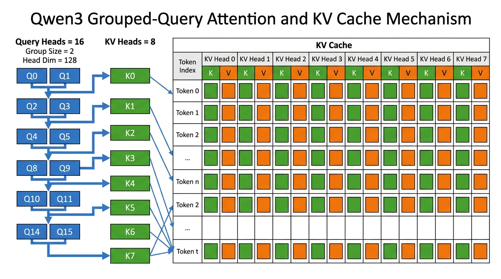
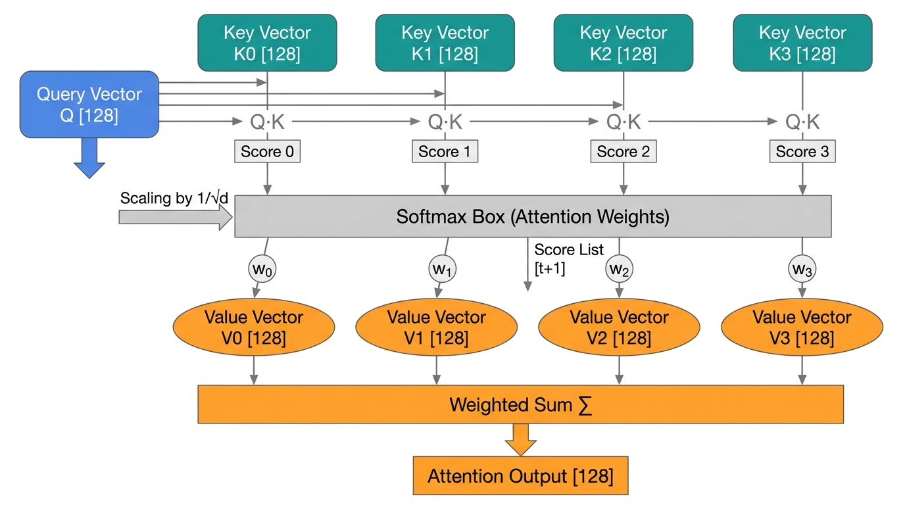
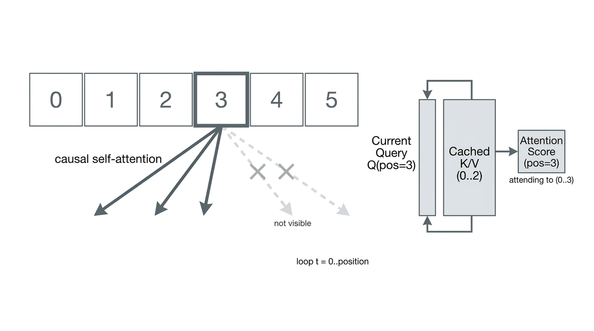

# 4. Qwen3 Attention 详细计算

本文专门展开 Qwen3 0.6B 在本项目里的 self-attention 计算。重点不是泛泛介绍
Transformer，而是把当前实现里的张量形状、循环边界、GQA、KV cache 和 causal
约束逐项拆开。

相关代码：

- [`src/runtime/cpu/qwen_cpu_model.cpp`](../../src/runtime/cpu/qwen_cpu_model.cpp)
- [`src/runtime/cpu/kv_cache.cpp`](../../src/runtime/cpu/kv_cache.cpp)
- [`src/backends/mps/mps_backend.mm`](../../src/backends/mps/mps_backend.mm)
- [`models/qwen3-0.6b/config.json`](../../models/qwen3-0.6b/config.json)

## 模块位置

在单层 `apply_layer()` 里，attention 的计算顺序是：

```text
hidden
  -> input RMSNorm
  -> q_proj / k_proj / v_proj
  -> q_norm / k_norm
  -> RoPE(q) / RoPE(k)
  -> store_kv(layer, position, k, v)
  -> attention(q, kv_cache[layer, 0..position])
  -> o_proj
  -> residual add
```

对应 CPU 代码在 [`qwen_cpu_model.cpp`](../../src/runtime/cpu/qwen_cpu_model.cpp)：

```cpp
matvec(layer.q_proj, normed, q);
matvec(layer.k_proj, normed, k);
matvec(layer.v_proj, normed, v);
qk_norm(q, heads, layer.q_norm);
qk_norm(k, kv_heads, layer.k_norm);
apply_rope(q, heads, position);
apply_rope(k, kv_heads, position);
store_kv(layer_index, position, k, v);
attention(layer_index, position, q, attn_out);
matvec(layer.o_proj, attn_out, projected);
```

见 [`qwen_cpu_model.cpp`](../../src/runtime/cpu/qwen_cpu_model.cpp) 中
`apply_layer()` 的 Q/K/V 到 `o_proj` 这一段。

## 关键维度

Qwen3 0.6B 的 attention 参数：

```text
hidden size H      = 1024
query heads Nq     = 16
kv heads Nkv       = 8
head dim D         = 128
group size G       = Nq / Nkv = 2
attention dim      = Nq * D = 2048
kv dim             = Nkv * D = 1024
```

所以当前 token 进入 attention 时，几个核心张量形状是：

```text
input hidden       [1024]
q                  [16, 128]
k                  [8, 128]
v                  [8, 128]
attn_out           [16, 128]
```

这里 `q` 的 head 数比 `k/v` 多，说明 Qwen3 0.6B 用的是 GQA，而不是标准多头 attention。

## 从 hidden 到 Q/K/V

attention 并不是直接对 hidden 做点积，而是先做三次线性投影：

```text
q = Wq * x
k = Wk * x
v = Wv * x
```

在当前实现里，`matvec()` 是逐行做 BF16 权重和 FP32 输入的矩阵乘法。对一个 token 来说，
它本质上是 3 次独立的线性层。

权重形状：

```text
q_proj.weight      [2048, 1024]
k_proj.weight      [1024, 1024]
v_proj.weight      [1024, 1024]
```

输出形状：

```text
q                  [2048] -> reshape 为 [16, 128]
k                  [1024] -> reshape 为 [8, 128]
v                  [1024] -> reshape 为 [8, 128]
```

`q`、`k`、`v` 都来自当前 token 当前层的 hidden，所以 attention 的“当前输入”只是一条向量；
历史信息不是重新从 hidden 里推导，而是后面通过 KV cache 读回来。

## QK Norm 和 RoPE

Qwen3 在投影之后还会对 `q` 和 `k` 做两步处理：

1. `qk_norm`
2. `RoPE`

顺序是：

```text
q = QKNorm(q)
k = QKNorm(k)
q = RoPE(q, position)
k = RoPE(k, position)
```

### QK Norm

`qk_norm()` 是按每个 head 单独做 RMS 风格的归一化：

```text
mean_square = mean(v_i^2)
scale = 1 / sqrt(mean_square + eps)
out_i = v_i * scale * learned_weight_i
```

这里的目的不是替代 input RMSNorm，而是专门稳定 query 和 key 的尺度，让点积更可控。

### RoPE

`apply_rope()` 把位置信息写进 `q` 和 `k`，而不是写进 `v`。这符合 RoPE 的标准用法：

```text
q' = RoPE(q, position)
k' = RoPE(k, position)
v  = v
```

因此：

- KV cache 里保存的 `k` 是已经做过 RoPE 的
- KV cache 里保存的 `v` 是原始 value 投影

这也是为什么历史 token 不需要在每次 decode 时重新做 RoPE。

## KV Cache 到底缓存了什么



`kv_cache` 不是缓存 hidden，也不是缓存 attention 输出，而是缓存每一层、每个位置的
`K/V` 投影结果。

存储发生在当前 token 的 `k`、`v` 计算完之后：

```cpp
store_kv(layer_index, position, k, v);
```

见 [`qwen_cpu_model.cpp`](../../src/runtime/cpu/qwen_cpu_model.cpp) 中的 `store_kv()` 调用。

真正的写入逻辑在 [`kv_cache.cpp`](../../src/runtime/cpu/kv_cache.cpp)：

```cpp
const auto base = offset(layer, position, 0);
std::copy(key.begin(), key.end(), keys_.begin() + static_cast<std::ptrdiff_t>(base));
std::copy(value.begin(), value.end(), values_.begin() + static_cast<std::ptrdiff_t>(base));
```

见 [`kv_cache.cpp`](../../src/runtime/cpu/kv_cache.cpp) 中 `KvCache::store()` 的复制逻辑。

可以把它理解成：

```text
cache[layer][token_position] = {k, v}
```

历史 token 的信息之所以能影响当前 token，不是因为旧 hidden 被保留下来，而是因为旧 token
在每一层产生的 `K/V` 被保留了下来。

## GQA 是怎么映射的

Qwen3 0.6B 不是每个 query head 都有独立的 key/value head，而是 16 个 query head
共享 8 个 KV head。

代码里这个映射是：

```cpp
const auto group = heads / kv_heads;
const auto kv_head = head / group;
```

见 [`qwen_cpu_model.cpp`](../../src/runtime/cpu/qwen_cpu_model.cpp) 中
`group = heads / kv_heads` 和 `kv_head = head / group`。

对当前模型：

```text
group = 16 / 8 = 2
```

所以 head 映射是：

```text
Q head 0, 1   -> KV head 0
Q head 2, 3   -> KV head 1
Q head 4, 5   -> KV head 2
...
Q head 14, 15 -> KV head 7
```

这能明显减少 KV cache 大小，因为缓存维度从 `16 * 128` 降到了 `8 * 128`。

## 单个 head 的 attention 公式



对某个 query head `h`，attention 的数学形式是：

```text
score_t = (q_h · k_{h,t}) / sqrt(D)
weight_t = softmax(score)_t
out_h = sum_t weight_t * v_{h,t}
```

在 GQA 下，严格说是：

```text
score_t = (q_h · k_{kv_head(h), t}) / sqrt(D)
out_h = sum_t weight_t * v_{kv_head(h), t}
```

也就是 query head `h` 要先映射到自己的共享 KV head。

### 1. 点积打分

代码里先对某个 head、某个历史位置 `t` 做点积：

```cpp
float score = 0.0F;
for (std::size_t d = 0; d < head_dim; ++d) {
  score += q[q_base + d] * key[d];
}
score *= scale;
```

这里：

- `q_base = head * head_dim`
- `key` 指向 `kv_cache[layer, t, kv_head]`
- `scale = 1 / sqrt(head_dim)`

见 [`qwen_cpu_model.cpp`](../../src/runtime/cpu/qwen_cpu_model.cpp) 中
`attention()` 里的 score 累加循环。

### 2. Softmax

当前实现用了稳定版 softmax：

```text
max_score = max(score_t)
weight_t = exp(score_t - max_score) / sum_j exp(score_j - max_score)
```

对应代码：

```cpp
scores[t] = std::exp(scores[t] - max_score);
denom += scores[t];
```

见 [`qwen_cpu_model.cpp`](../../src/runtime/cpu/qwen_cpu_model.cpp) 中
`attention()` 里的 softmax 分母计算。

### 3. 对 Value 加权求和

softmax 得到权重后，再对同一个 KV head 的历史 value 做加权和：

```cpp
value += (scores[t] / denom) * cached_value[d];
```

见 [`qwen_cpu_model.cpp`](../../src/runtime/cpu/qwen_cpu_model.cpp) 中
`attention()` 里的 value 加权求和循环。

得到每个 query head 的输出后，把 16 个 head 拼起来，形成 `attn_out[2048]`。

## 为什么后面的 token 不会影响当前 token



这部分在实现里不是靠显式 mask 矩阵完成，而是靠循环边界完成。

当前代码：

```cpp
std::vector<float> scores(position + 1U);
for (std::size_t t = 0; t <= position; ++t) {
  ...
}
```

见 [`qwen_cpu_model.cpp`](../../src/runtime/cpu/qwen_cpu_model.cpp) 中
`scores(position + 1)` 和 `for (t = 0; t <= position; ++t)`。

这意味着：

- 只会读取 `0..position` 的 key/value
- `position + 1` 之后的位置根本不会进入打分数组
- softmax 也只在前缀上计算

所以当前 token 的 hidden 只依赖：

```text
token_0 .. token_position
```

不依赖：

```text
token_{position+1} ..
```

也就是说，这里没有显式上三角 `mask[t_query, t_key]`，但实现效果和 causal mask 完全等价。

## 单 token decode 为什么只需要一个 query

在增量解码时，当前步只新进入一个 token，所以：

- 当前层只新算一个 `q`
- 当前层也只新算一个 `k/v`
- 历史 `k/v` 从 cache 里直接读取

因此 attention 的本质是：

```text
一个当前 query
  对
一串历史 key/value
做匹配和聚合
```

不是“整个 `[T, T]` 注意力矩阵每次都重算一遍”。

这正是 KV cache 能加速 decode 的原因。

## 和标准全序列 attention 的区别

训练或 prefill 的标准写法通常是：

```text
Q = [T, Hq, D]
K = [T, Hk, D]
V = [T, Hk, D]
scores = Q @ K^T
scores += causal_mask
weights = softmax(scores)
output = weights @ V
```

而这个项目当前 decode 路径的写法更接近：

```text
q_cur = current query
K_hist = cached keys[0..position]
V_hist = cached values[0..position]
scores = q_cur @ K_hist^T
weights = softmax(scores)
out = weights @ V_hist
```

两者数学上等价，但后者省掉了对旧 token 的重复计算。

## MPS 路径的实现

Metal kernel 里是同样的逻辑。`attention_f32` 里：

- 每个线程负责一个 `(head, dim)`
- 先遍历 `token = 0..position` 求 `max_score`
- 再遍历一次求 softmax 分母和 value 加权和

关键代码见 [`mps_backend.mm`](../../src/backends/mps/mps_backend.mm) 中
`attention_f32` kernel 的两次 `token <= position` 遍历。

这说明 CPU 与 MPS 两条路径在 attention 语义上是一致的，差别主要在执行后端，不在计算图。

## 当前实现的复杂度

对单个新 token、单层 attention：

```text
Q/K/V projection      O(H * A) 近似线性层代价
score compute         O(Nq * position * D)
value reduction       O(Nq * position * D)
```

随着 `position` 增长，attention 核心成本主要线性增长在上下文长度上。KV cache 只能避免
重复计算旧 token 的投影和旧层状态，不能把 attention 的历史读取成本降成常数。

## 对照理解

可以把当前 token 的 attention 过程理解成：

1. 把当前 hidden 变成 16 个 query head
2. 把当前 hidden 变成 8 个 key/value head
3. 给当前 `q/k` 加上当前位置的 RoPE
4. 把当前 `k/v` 存到本层 cache
5. 对每个 query head，去历史 cache 里找自己对应的 KV head
6. 对所有历史位置打分、softmax
7. 对历史 value 做加权求和
8. 拼回 `attn_out`
9. 经过 `o_proj` 映射回 hidden size
10. 加回残差

这就是 decoder-only Qwen3 attention 在本项目里的完整计算链路。
